# [Tic Tac Toe](http://ozz1.ddns.net)

Tic Tac Toe is a game for two players, X and O, who take turns marking the spaces in a 3×3 grid. The player who succeeds in placing three of their marks in a horizontal, vertical, or diagonal row wins the game.

[Click here to play the Game](https://code3-30a1dbb24e94.herokuapp.com/)
## How to play

1. The game is played on a 3x3 board
2. Players take turns to choose the cell on the game board.
3. Place three of the symbols in a row, column or diagonal to win
4. If the entire board is filled and there is no winner, the game is a draw.  
    Good Luck! :)

## Flowchart

This is the flowchart of the game

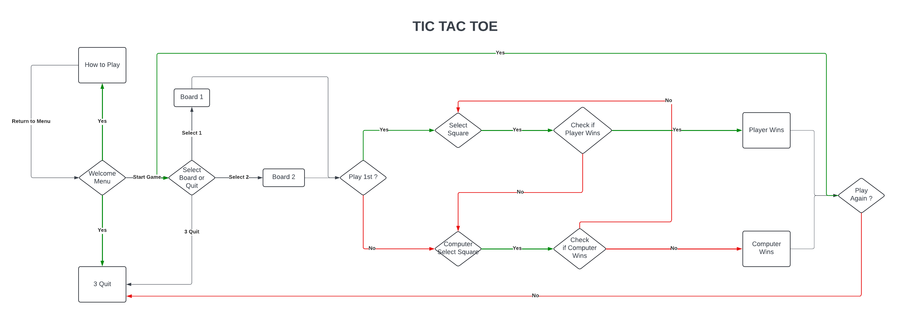

Done via [Lucidchart](https://www.lucidchart.com/pages/)

## User Stories

* I want the game to be easy to navigate

* I want the game to be fun and entertainment

* I want the game to be user friendly

## User Goals

Play vs Computer
* I want to play against the computer

## Future Features

* Play against another Player

### Features

* The Main Menu  
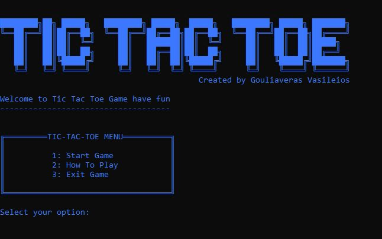

* Menu Option 2  
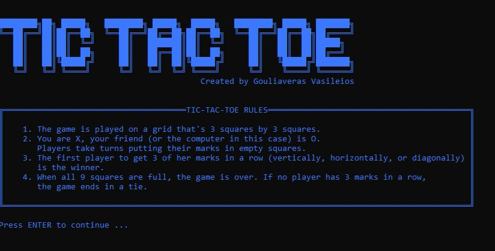

* Menu Option 1 Start the Game and Select board style  
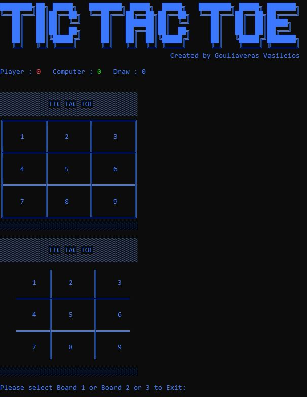

* Board 1 Gameplay  
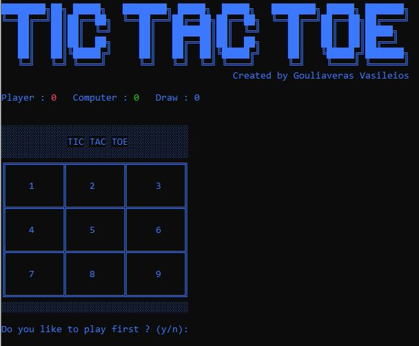

* Board 2 Gameplay  
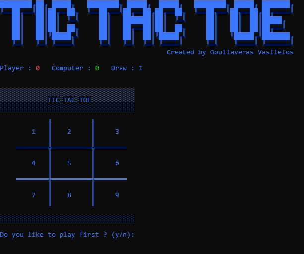

### Winning Options

* Win in a Row  
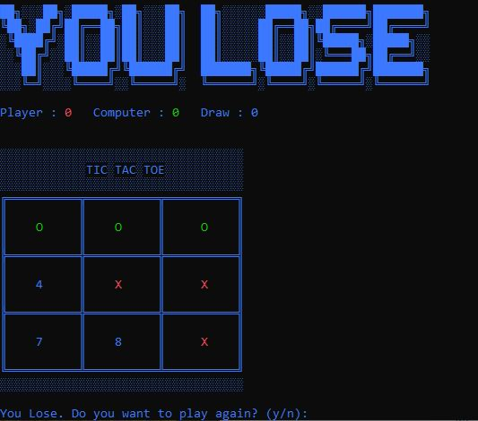

* Win in a Column  
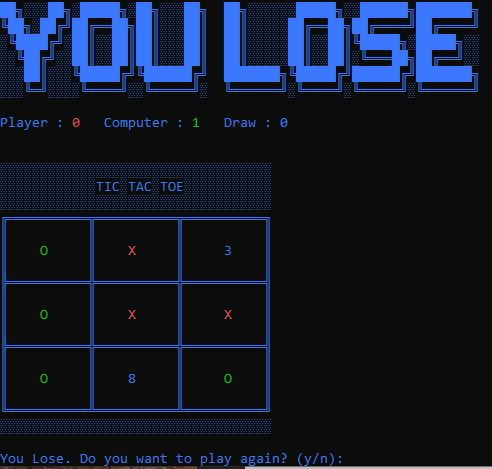

* Win Diagonal  
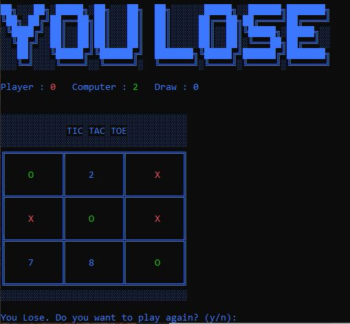

# Testing

Error Message on Main Menu
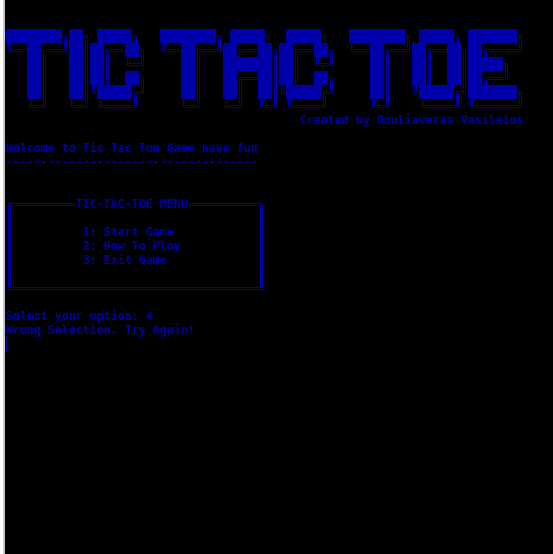

## Validator Testing
Checked in PEP8
 - No Errors
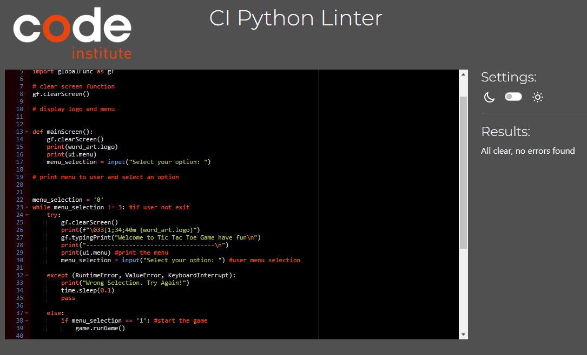

# Deployment

The app was deployed through Heroku. The steps are as following:

Login (or signup) to [Heroku](https://id.heroku.com/login) and [Github](https://github.com/login)

### Heroku

1. After creating a Heroku account, click "New" to create a new app from the dashboard.

2. Enter a unique app name, select your region and click "Create app".

3. Navigate to settings tab and scroll down to view the Config Vars section and click "Reveal Config Vars".

4. Enter port into the Key box and 8000 into the Value box and click the Add button.

5. Navigate to Buildpacks and click "Add buildpack".

6. First add Python, then add NodeJS into Buildpacks. (Ensure that it is in order!)

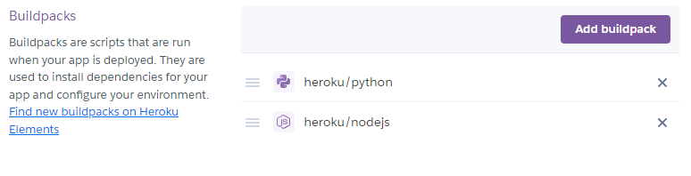

7. Navigate to Deploy tab (same navigationbar as settings).

8. Choose GitHub as the Deployment method.

9. Search for the repository name, select the branch that you would like to build from, and connect it via the "Connect" button.

10. Choose from "Automatic" or "Manual" deployment options, I went for automatic. Click "Deploy Branch".

11. When the build is finished, click "View" link to bring you to your deployed site. You can also find the link via Settings -> Domains.
__________________________________________________________________________________________________________

### Github

Go to the repository for this project -> [code3](https://github.com/ozz1webdev/code3)

#### Forking

Click the Fork button in the top right corner.

#### Clone

1. Click the button called Code

2. Click on the code button, select whether you would like to clone with HTTPS, SSH or GitHub CLI and copy the link shown.

3. Open the terminal in your code editor and change the current working directory to the location you want to use for the cloned directory.

4. Type 'git clone' into the terminal and then paste the link you copied. Press enter.

## Credits
The word art are made by https://www.fancytextpro.com/

###Libraries used

[Colorama](https://pypi.org/project/colorama/)